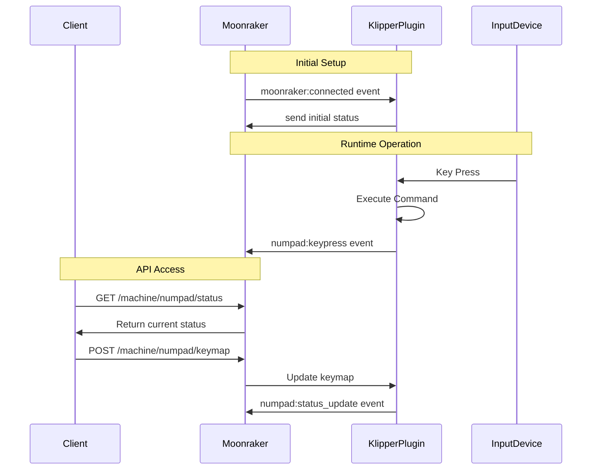

# Numpad Macros Plugin for Klipper

## Overview
The Numpad Macros plugin enables you to use USB input devices (numpads, knobs, etc.) as control interfaces for your Klipper-powered 3D printer. This plugin provides customizable key mappings to execute common printer commands, making printer control more convenient and efficient.

## How It Works

### Architecture
The plugin consists of two main components that work together:

1. **Klipper Plugin (numpad_macros.py)**
   - Handles direct input device interaction
   - Processes key events
   - Executes mapped commands
   - Sends status updates to Moonraker

2. **Moonraker Component (numpad_macros_service.py)**
   - Provides web API endpoints
   - Handles configuration management
   - Enables real-time status updates
   - Facilitates integration with front-end clients

### Communication Flow


## Installation

### Prerequisites
- Klipper installed and configured
- Moonraker installed and configured
- USB input devices (numpad, volume knob, etc.)
- Python 3.7 or higher
- python3-evdev package

### Automatic Installation
1. Clone the repository:
```bash
cd ~
git clone https://github.com/your-username/numpad_macros.git
```

2. Run the installation script:
```bash
cd ~/numpad_macros
chmod +x install.sh
./install.sh
```

## Configuration

### Example Macro Configuration
First, add the following macro definitions to your `printer.cfg`:

```ini
[gcode_macro _HOME_ALL]
description: Home all axes
gcode:
    RESPOND TYPE=echo MSG="Numpad macros: Home all axes"
    HOME

[gcode_macro _SAFE_PARK_OFF]
description: Safely park all axes and turn off steppers
gcode:
    
        RESPOND TYPE=error MSG="Numpad macros: Cannot park, printer is currently printing"
    
        
        
        
        RESPOND TYPE=echo MSG="Numpad macros: Parking at Z={max_z} and disabling steppers"
        
        
            RESPOND TYPE=echo MSG="Numpad macros: Homing before parking"
            G28
        
        
        
            G0 Z{max_z} F600
        
        G0 X{printer.toolhead.axis_maximum.x/2} Y{printer.toolhead.axis_maximum.y/2} F3000
        DISABLE_X_Y_STEPPERS
    

[gcode_macro _CANCEL_PRINT]
description: Will cancel current print
gcode:
    RESPOND TYPE=echo MSG="Numpad macros: Will cancel current print"
    CANCEL_PRINT

[gcode_macro _PRE_HEAT_BED]
description: Will heat the bed up to a reasonable temperature
gcode:
    RESPOND TYPE=echo MSG="Numpad macros: Will heat the bed up to a reasonable temperature"
    M140 S60

[gcode_macro _PRE_HEAT_NOZZLE]
description: Will heat the nozzle up to a reasonable temperature for nozzle cleaning
gcode:
    RESPOND TYPE=echo MSG="Numpad macros: Will heat the nozzle up to a reasonable temperature"
    M104 S220

[gcode_macro _BED_PROBE_MANUAL_ADJUST]
description: Utility to level the bed with gantry, probing ends with adjustments help
gcode:
    RESPOND TYPE=echo MSG="Numpad macros: Utility to level the bed with gantry, probing ends with adjustments help"
    BED_PROBE_MANUAL_ADJUST

[gcode_macro _DISABLE_X_Y_STEPPERS]
description: Will turn off x y stepper axis
gcode:
    RESPOND TYPE=echo MSG="Numpad macros: Will turn off x y stepper axis"
    DISABLE_X_Y_STEPPERS

[gcode_macro _CALIBRATE_NOZZLE_OFFSET_PROBE]
description: Will run the calibration of nozzle offset from probe
gcode:
    RESPOND TYPE=echo MSG="Numpad macros: Will run the calibration of nozzle offset from probe"
    PROBE_NOZZLE_DISTANCE

[gcode_macro _REPEAT_LAST_PRINT]
description: Will repeat the last print
gcode:
    RESPOND TYPE=echo MSG="Numpad macros: Will repeat the last print"
    
    
        RESPOND TYPE=echo MSG="Numpad macros: Repeating print of '{last_file}'"
        SDCARD_PRINT_FILE FILENAME="{last_file}"
    
        RESPOND TYPE=echo MSG="Numpad macros: No previous print file found"
    

[gcode_macro _TOGGLE_PAUSE_RESUME]
description: Will pause if printing, will resume if paused
gcode:
    RESPOND TYPE=echo MSG="Numpad macros: Will pause if printing, will resume if paused"
    
        RESPOND TYPE=echo MSG="Numpad macros: Print is paused - Resuming"
        RESUME
    
        
            RESPOND TYPE=echo MSG="Numpad macros: Print is active - Pausing"
            PAUSE
        
            RESPOND TYPE=echo MSG="Numpad macros: No active print"
        
    

[gcode_macro _EMERGENCY_STOP]
description: Will emergency stop machine and immediately halt all actions
gcode:
    RESPOND TYPE=echo MSG="Numpad macros: Will emergency stop machine and immediately halt all actions"
    EMERGENCY_STOP
```

### Numpad Configuration
Then, add the numpad configuration section:

```ini
[numpad_macros]
# Multiple device support (comma-separated)
device_paths: /dev/input/by-id/usb-INSTANT_USB_Keyboard-event-kbd, /dev/input/by-id/usb-INSTANT_USB_Keyboard-event-if01

# Enable debug logging for troubleshooting
debug_log: True

# Key mappings
key_1: _HOME_ALL                    # Home all axes
key_2: _SAFE_PARK_OFF              # Park and disable steppers
key_3: _CANCEL_PRINT               # Cancel current print
key_4: _PRE_HEAT_BED              # Pre-heat bed
key_5: _PRE_HEAT_NOZZLE           # Pre-heat nozzle
key_6: _BED_PROBE_MANUAL_ADJUST    # Manual bed adjustment
key_7: _DISABLE_X_Y_STEPPERS       # Disable X/Y steppers
key_8: _CALIBRATE_NOZZLE_OFFSET_PROBE # Calibrate nozzle offset
key_9: _REPEAT_LAST_PRINT         # Repeat last print
key_0: _TOGGLE_PAUSE_RESUME       # Toggle pause/resume
key_dot: _EMERGENCY_STOP          # Emergency stop
```

### Default Behavior
Any key not explicitly configured in the `[numpad_macros]` section will respond with a message indicating it's not assigned:
```
RESPOND MSG="Key X not assigned yet"
```

This provides clear feedback to users about which keys need configuration while preventing unintended actions.

### Supported Keys
| Physical Key | Config Name | Default Action | Typical Assignment |
|-------------|-------------|----------------|-------------------|
| 1 or KP1    | key_1      | Not assigned message | _HOME_ALL |
| 2 or KP2    | key_2      | Not assigned message | _SAFE_PARK_OFF |
| 3 or KP3    | key_3      | Not assigned message | _CANCEL_PRINT |
| 4 or KP4    | key_4      | Not assigned message | _PRE_HEAT_BED |
| 5 or KP5    | key_5      | Not assigned message | _PRE_HEAT_NOZZLE |
| 6 or KP6    | key_6      | Not assigned message | _BED_PROBE_MANUAL_ADJUST |
| 7 or KP7    | key_7      | Not assigned message | _DISABLE_X_Y_STEPPERS |
| 8 or KP8    | key_8      | Not assigned message | _CALIBRATE_NOZZLE_OFFSET_PROBE |
| 9 or KP9    | key_9      | Not assigned message | _REPEAT_LAST_PRINT |
| 0 or KP0    | key_0      | Not assigned message | _TOGGLE_PAUSE_RESUME |
| . or KP_DOT | key_dot    | Not assigned message | _EMERGENCY_STOP |
| Enter       | key_enter  | Not assigned message | Custom macro |
| Alt-1       | key_1_alt  | Not assigned message | Custom macro |
| Alt-2       | key_2_alt  | Not assigned message | Custom macro |
| (etc...)    | ...        | Not assigned message | Custom macro |

## Finding Your Device Paths

1. List available input devices:
```bash
ls -l /dev/input/by-id/
```

2. Get detailed device information:
```bash
evtest
```

## API Endpoints

Moonraker exposes the following HTTP endpoints:

- `GET /machine/numpad/status` - Get current status
- `GET /machine/numpad/keymap` - Get current keymap
- `POST /machine/numpad/keymap` - Update keymap
- `GET /machine/numpad/devices` - List connected devices

## Debugging

### Enable Debug Logging
```ini
[numpad_macros]
debug_log: True
```

### Test Command
```bash
NUMPAD_TEST
```

This will show:
- Connected devices
- Current key mappings
- Debug status
- Current pending key (if any)

### Common Issues

1. **Device Not Found**
   - Check USB connections
   - Verify device paths
   - Check user permissions (input group)

2. **Keys Not Responding**
   - Enable debug logging
   - Check Klipper logs
   - Verify device detection
   - Check if key is properly mapped in config

3. **Permission Issues**
   - Verify input group membership: `groups | grep input`
   - Log out and back in after installation
   - Check device permissions: `ls -l /dev/input/by-id/`

## License
[Your License Here]