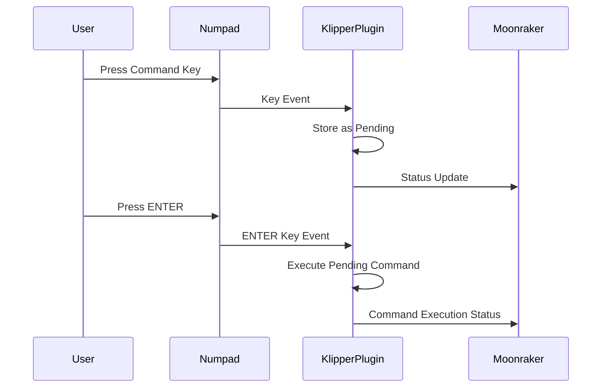

# Numpad Macros Plugin for Klipper

## Overview
The Numpad Macros plugin enables you to use USB input devices (numpads, knobs, etc.) as control interfaces for your Klipper-powered 3D printer. This plugin provides customizable key mappings with a two-step confirmation process for safe operation.

## Key Features
- Two-step command execution (Key + ENTER confirmation)
- Multiple device support
- Configurable key mappings
- Real-time status updates
- Debug logging
- Automatic device recovery
- Web API integration

## How It Works

### Two-Step Command Process
1. Press the desired command key (1-9, 0, DOT)
2. Press ENTER to confirm and execute the command
   - The command won't execute until confirmed with ENTER
   - Pressing a new command key before ENTER will change the pending command

### Architecture
The plugin consists of two main components:

1. **Klipper Plugin (numpad_macros.py)**
   - Handles direct input device interaction
   - Processes key events
   - Manages two-step command confirmation
   - Executes mapped commands
   - Sends status updates to Moonraker

2. **Moonraker Component (numpad_macros_service.py)**
   - Provides web API endpoints
   - Handles configuration management
   - Enables real-time status updates
   - Facilitates integration with front-end clients

### Communication Flow


## Installation

### Prerequisites
- Klipper installed and configured
- Moonraker installed and configured
- USB input devices (numpad, volume knob, etc.)
- Python 3.7 or higher
- python3-evdev package

### Automatic Installation
1. Clone the repository:
```bash
cd ~
git clone https://github.com/your-username/numpad_macros.git
```

2. Run the installation script:
```bash
cd ~/numpad_macros
chmod +x install.sh
./install.sh
```

## Configuration

### Example Macro Configuration
Add the following macro definitions to your `printer.cfg`:

[Previous macro definitions remain the same...]

### Numpad Configuration
Then, add the numpad configuration section:

```ini
[numpad_macros]
# Multiple device support (comma-separated)
device_paths: /dev/input/by-id/usb-INSTANT_USB_Keyboard-event-kbd, /dev/input/by-id/usb-INSTANT_USB_Keyboard-event-if01

# Enable debug logging for troubleshooting
debug_log: True

# Key mappings - Remember all commands require ENTER confirmation
key_1: _HOME_ALL                    # Home all axes
key_2: _SAFE_PARK_OFF              # Park and disable steppers
key_3: _CANCEL_PRINT               # Cancel current print
key_4: _PRE_HEAT_BED              # Pre-heat bed
key_5: _PRE_HEAT_NOZZLE           # Pre-heat nozzle
key_6: _BED_PROBE_MANUAL_ADJUST    # Manual bed adjustment
key_7: _DISABLE_X_Y_STEPPERS       # Disable X/Y steppers
key_8: _CALIBRATE_NOZZLE_OFFSET_PROBE # Calibrate nozzle offset
key_9: _REPEAT_LAST_PRINT         # Repeat last print
key_0: _TOGGLE_PAUSE_RESUME       # Toggle pause/resume
key_dot: _EMERGENCY_STOP          # Emergency stop
```

### Key Operation
1. Press the desired key (1-9, 0, or DOT)
2. The command will be stored as pending
3. Press ENTER to execute the command
4. If you press a different key before ENTER, the new command becomes pending instead

### Supported Keys
| Physical Key | Config Name | Required Confirmation | Default Action |
|-------------|-------------|----------------------|----------------|
| 1 or KP1    | key_1      | ENTER               | _HOME_ALL |
| 2 or KP2    | key_2      | ENTER               | _SAFE_PARK_OFF |
| 3 or KP3    | key_3      | ENTER               | _CANCEL_PRINT |
| 4 or KP4    | key_4      | ENTER               | _PRE_HEAT_BED |
| 5 or KP5    | key_5      | ENTER               | _PRE_HEAT_NOZZLE |
| 6 or KP6    | key_6      | ENTER               | _BED_PROBE_MANUAL_ADJUST |
| 7 or KP7    | key_7      | ENTER               | _DISABLE_X_Y_STEPPERS |
| 8 or KP8    | key_8      | ENTER               | _CALIBRATE_NOZZLE_OFFSET_PROBE |
| 9 or KP9    | key_9      | ENTER               | _REPEAT_LAST_PRINT |
| 0 or KP0    | key_0      | ENTER               | _TOGGLE_PAUSE_RESUME |
| . or KP_DOT | key_dot    | ENTER               | _EMERGENCY_STOP |
| Enter       | key_enter  | N/A                 | Command Confirmation |

[Rest of the documentation remains the same...]

## Finding Your Device Paths

1. List available input devices:
```bash
ls -l /dev/input/by-id/
```

2. Get detailed device information:
```bash
evtest
```

## API Endpoints

Moonraker exposes the following HTTP endpoints:

- `GET /machine/numpad/status` - Get current status
- `GET /machine/numpad/keymap` - Get current keymap
- `POST /machine/numpad/keymap` - Update keymap
- `GET /machine/numpad/devices` - List connected devices

## Debugging

### Enable Debug Logging
```ini
[numpad_macros]
debug_log: True
```

### Test Command
```bash
NUMPAD_TEST
```

This will show:
- Connected devices
- Current key mappings
- Debug status
- Current pending key (if any)

### Common Issues

1. **Device Not Found**
   - Check USB connections
   - Verify device paths
   - Check user permissions (input group)

2. **Keys Not Responding**
   - Enable debug logging
   - Check Klipper logs
   - Verify device detection
   - Check if key is properly mapped in config

3. **Permission Issues**
   - Verify input group membership: `groups | grep input`
   - Log out and back in after installation
   - Check device permissions: `ls -l /dev/input/by-id/`

## License
GNU GENERAL PUBLIC LICENSE Version 3