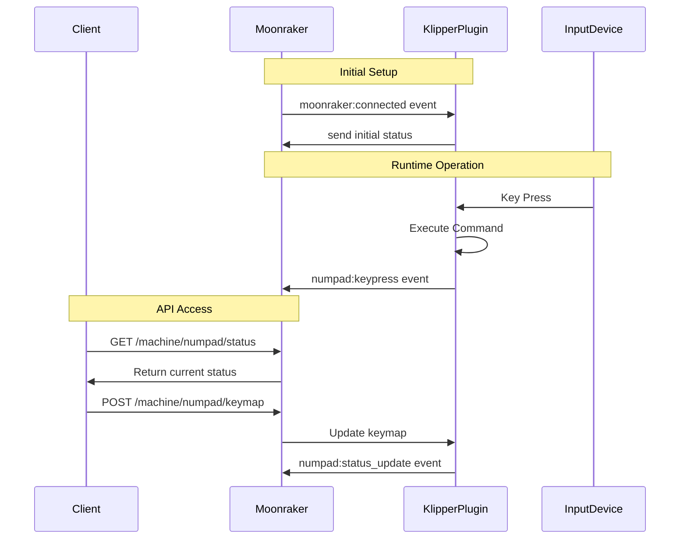

# Numpad Macros Plugin for Klipper

## Overview
The Numpad Macros plugin enables you to use USB input devices (numpads, knobs, etc.) as control interfaces for your Klipper-powered 3D printer. This plugin provides customizable key mappings to execute common printer commands, making printer control more convenient and efficient.

## How It Works

### Architecture
The plugin consists of two main components that work together:

1. **Klipper Plugin (numpad_macros.py)**
   - Handles direct input device interaction
   - Processes key events
   - Executes mapped commands
   - Sends status updates to Moonraker

2. **Moonraker Component (numpad_macros_service.py)**
   - Provides web API endpoints
   - Handles configuration management
   - Enables real-time status updates
   - Facilitates integration with front-end clients

### Communication Flow


### Key Features
- Support for both numpad and regular number keys
- Multiple device support
- Customizable key mappings
- Real-time status updates
- Error recovery and reconnection
- Comprehensive debugging capabilities

## Installation

### Prerequisites
- Klipper installed and configured
- Moonraker installed and configured
- USB input devices (numpad, volume knob, etc.)
- Python 3.7 or higher
- python3-evdev package

### Automatic Installation
1. Clone the repository:
```bash
cd ~
git clone https://github.com/your-username/numpad_macros.git
```

2. Run the installation script:
```bash
cd ~/numpad_macros
chmod +x install.sh
./install.sh
```

## Configuration

### Printer Configuration
Add to your `printer.cfg`:
```ini
[numpad_macros]
# Multiple device support (comma-separated)
device_paths: /dev/input/by-id/device1, /dev/input/by-id/device2

# Enable debug logging for troubleshooting
debug_log: True

# Key mappings
key_1: HOME                    # G28 (Both numpad and regular 1)
key_2: PROBE_BED_MESH         # Generate bed mesh
key_3: Z_TILT_ADJUST          # Adjust Z tilt
key_4: BED_PROBE_MANUAL_ADJUST # Manual bed adjustment
key_5: TURN_ON_LIGHT          # Turn on printer light
key_6: TURN_OFF_LIGHT         # Turn off printer light
key_7: DISABLE_X_Y_STEPPERS   # Disable X/Y steppers
key_8: DISABLE_EXTRUDER_STEPPER # Disable extruder
key_9: COLD_CHANGE_FILAMENT   # Change filament
key_0: TOGGLE_FILAMENT_SENSOR # Toggle filament sensor
key_DOT: PROBE_NOZZLE_DISTANCE # Probe calibration
key_ENTER: RESUME             # Resume print
key_GRAVE: EMERGENCY_STOP     # Emergency stop
```

### Supported Keys
| Physical Key | Plugin Key Name | Default Command |
|-------------|----------------|-----------------|
| 1 or KP1    | key_1         | HOME           |
| 2 or KP2    | key_2         | PROBE_BED_MESH |
| ...         | ...           | ...            |
| . or KP_DOT | key_DOT       | PROBE_NOZZLE_DISTANCE |
| Enter       | key_ENTER     | RESUME         |
| `           | key_GRAVE     | EMERGENCY_STOP |

## Finding Your Device Paths

1. List available input devices:
```bash
ls -l /dev/input/by-id/
```

2. Get detailed device information:
```bash
evtest
```

## API Endpoints

Moonraker exposes the following HTTP endpoints:

- `GET /machine/numpad/status` - Get current status
- `GET /machine/numpad/keymap` - Get current keymap
- `POST /machine/numpad/keymap` - Update keymap
- `GET /machine/numpad/devices` - List connected devices

## Debugging

### Enable Debug Logging
```ini
[numpad_macros]
debug_log: True
```

### Test Command
```bash
NUMPAD_TEST
```

This will show:
- Connected devices
- Current key mappings
- Debug status

### Common Issues

1. **Device Not Found**
   - Check USB connections
   - Verify device paths
   - Check user permissions

2. **Keys Not Responding**
   - Enable debug logging
   - Check Klipper logs
   - Verify device detection

3. **Permission Issues**
   - Verify input group membership
   - Log out and back in after installation
   - Check device permissions

## Contributing
- Report issues on GitHub
- Submit pull requests for improvements
- Check documentation for updates

## License
[Your License Here]